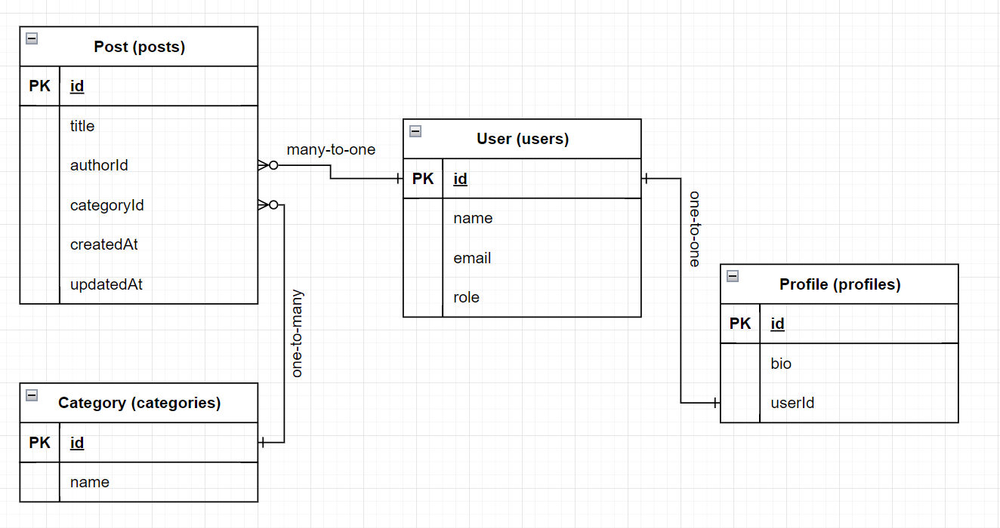

## ERD Diagram

Prisma is an open-source database toolkit that simplifies database access in modern web applications. It provides a set of tools and libraries for working with databases, making it easier for developers to interact with databases and manage database schemas. Prisma is particularly popular among Node.js and TypeScript developers, but it supports multiple programming languages and databases.

    Here are some key features of Prisma and why it is commonly used:

       * Database Agnostic: Prisma supports multiple databases, including PostgreSQL, MySQL, SQLite, and SQL Server. You can switch between databases easily by changing the Prisma configuration, allowing flexibility in your choice of database.

        * Automatic Schema Migrations: Prisma provides a schema migration tool that allows you to manage and version your database schema changes. It can automatically generate migration scripts based on changes in your Prisma schema.

        * Real-Time Data Sync: Prisma supports real-time data synchronization with the database. You can subscribe to changes in your database and receive real-time updates in your application, which is essential for building live features like chat applications and real-time dashboards.

        * Data Validation and Sanitization: Prisma helps with data validation and sanitation by automatically validating incoming data based on your schema. This can help prevent common data-related security vulnerabilities.

        * Integration with GraphQL and REST APIs: Prisma can be integrated into GraphQL and REST API backends, simplifying data fetching and manipulation for your API endpoints.

        * Developer Productivity: Prisma's intuitive and auto-completed API reduces the amount of boilerplate code you need to write when working with databases. This can significantly increase developer productivity and reduce development time.

        * Community and Ecosystem: Prisma has a growing and active community, which means you can find resources, documentation, and support from other developers who use Prisma in their projects.

Overall, Prisma is used to streamline database access, improve developer productivity, and enhance the safety and maintainability of database interactions in modern web and backend development. It abstracts many of the complexities of working directly with databases, making it a valuable tool for developers building robust and scalable applications.
